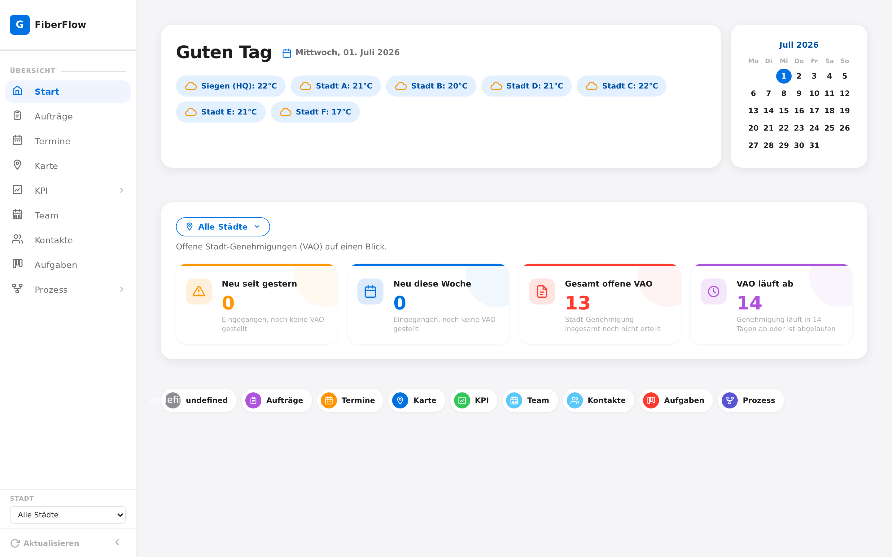
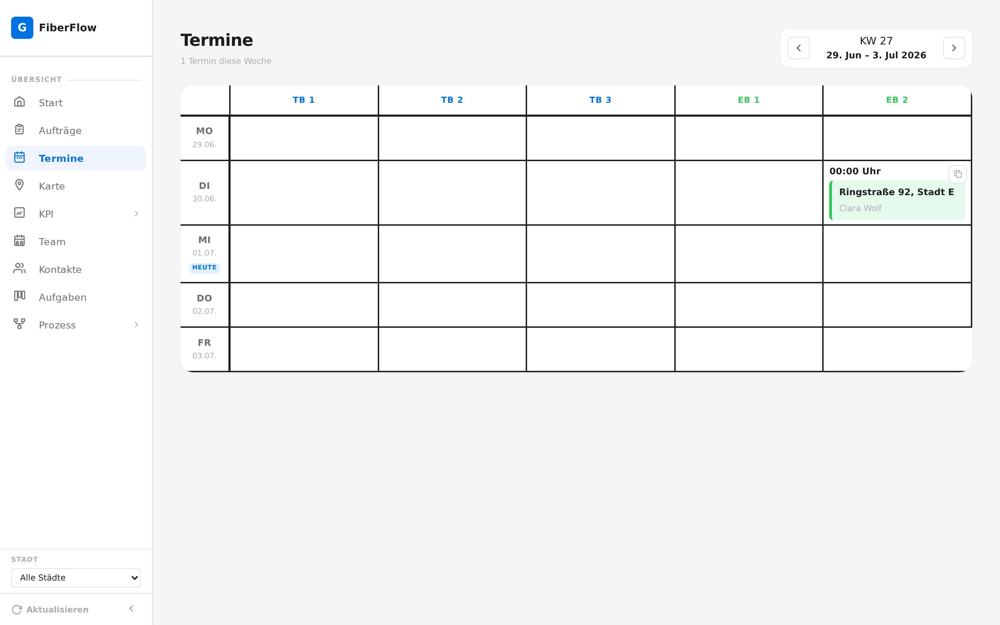
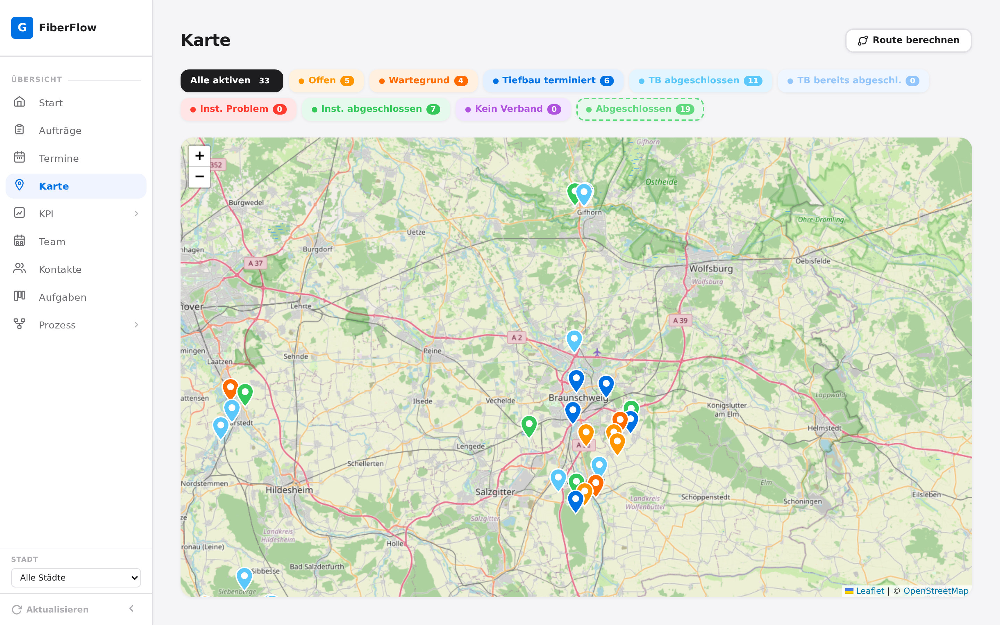
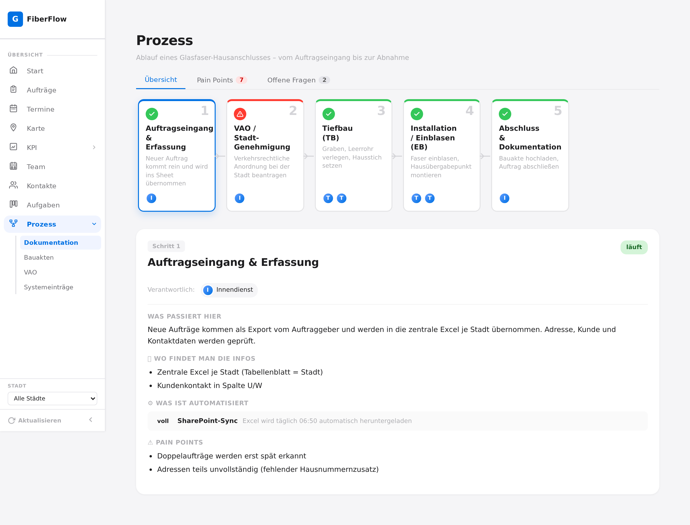
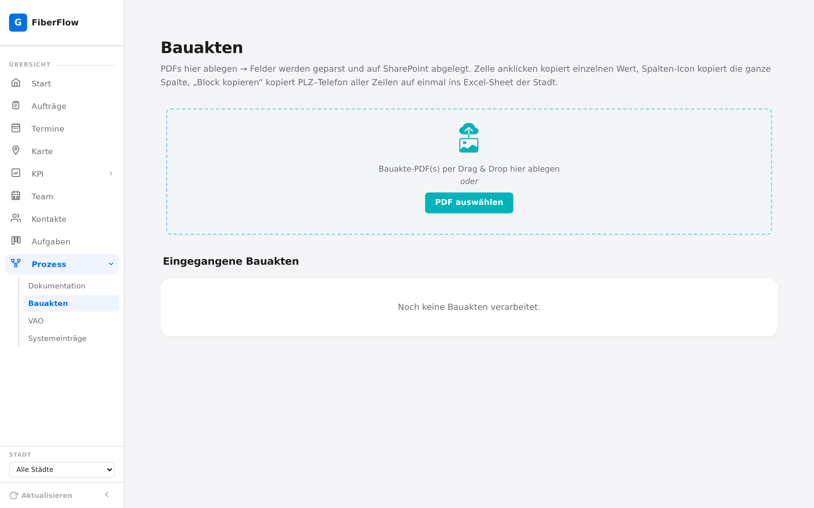

# FiberFlow — Glasfaser Auftrags-Dashboard

Internes Auftragsverfolgungssystem für den Ausbau von Glasfaser-Hausanschlüssen.
Bündelt alle Bauaufträge (Tiefbau + Installation) mehrerer Städte in einer Browser-Oberfläche:
Wochenplan, Karte, KPIs, Prozess-Doku und PDF-Bauakten-Verarbeitung.

> **Demo-Repo mit Dummy-Daten.** Dies ist eine anonymisierte Version eines produktiv
> eingesetzten Tools. Alle Namen, Adressen, Städte und Kennzahlen sind frei erfunden
> (`sample_data/`). Es sind keinerlei echte Kunden- oder Firmendaten enthalten.

---

## Screenshots

| Start / Übersicht | Termine (Wochenplan) |
|---|---|
|  |  |

| Karte (Status-Pins) | Prozess-Dokumentation |
|---|---|
|  |  |



---

## Features

- **Start-Dashboard** — offene Stadt-Genehmigungen (VAO) auf einen Blick, Wetter je Standort, Kalender
- **Termine** — Wochenplan-Grid je Tiefbau-/Einblas-Team, Wochennavigation
- **Karte** — alle Aufträge als farbcodierte Status-Pins (Leaflet + OpenStreetMap), Routenberechnung
- **KPI** — Übersicht, Status-Verteilung und Auswertung nach Kalenderwoche
- **Prozess** — dokumentierter End-to-End-Ablauf mit Pain Points & offenen Fragen
- **Bauakten** — PDF-Upload, automatisches Parsen der Felder, Ablage auf SharePoint
- **VAO / Systemeinträge / To-Dos / Team / Kontakte** — begleitende Verwaltungsseiten
- Single-User-Login, 5-Minuten-Cache auf die Excel-Datenquelle, Hintergrund-Refresh

---

## Technologie-Stack

| Schicht | Technologie |
|--------|-------------|
| Backend | Python 3.12+, FastAPI, openpyxl, pdfplumber |
| Frontend | Vanilla HTML / CSS / JS (kein Framework), Leaflet |
| Datenquelle | Excel-Datei (täglicher Sync), pro Stadt ein Tabellenblatt |
| Laufzeit | uvicorn, optional PM2 als Prozessmanager |

Die Anwendung liest die Aufträge aus einer Excel-Datei und stellt sie über eine
JSON-API (`/api/auftraege`, `/api/kpi/*`, `/api/prozess`, …) dem Frontend bereit.

---

## Lokal starten

```bash
cd backend
python3 -m venv venv
venv/bin/pip install -r requirements.txt

# Demo-Login setzen (Werte frei wählbar)
export DASHBOARD_USER=admin
export DASHBOARD_PASS=demo123
export DASHBOARD_SECRET=beliebiger-langer-zufallsstring

venv/bin/uvicorn main:app --host 127.0.0.1 --port 8502
```

Dann `http://127.0.0.1:8502` öffnen und mit den oben gesetzten Zugangsdaten einloggen.

Ohne weitere Konfiguration nutzt die App die mitgelieferten Dummy-Daten:
- Aufträge: `sample_data/beispiel_bauauftraege.xlsx` (überschreibbar via `EXCEL_PATH`)
- Prozess-Doku: `sample_data/prozess.json` (überschreibbar via `PROZESS_PATH`)

Der SharePoint-Upload der Bauakten ist optional und erfordert die
`SHAREPOINT_*`-Variablen (siehe `backend/.env.example`).

---

## Projektstruktur

```
.
├── backend/            FastAPI-App (main.py), Excel-Reader, Parser, Auth, DB-Module
├── frontend/           SPA – html/ · css/ · js/ (ein JS-Modul je Seite)
├── sample_data/        Dummy-Excel + Prozess-JSON + Generator-Skript
└── screenshots/        Oberflächen-Screenshots (Dummy-Daten)
```
